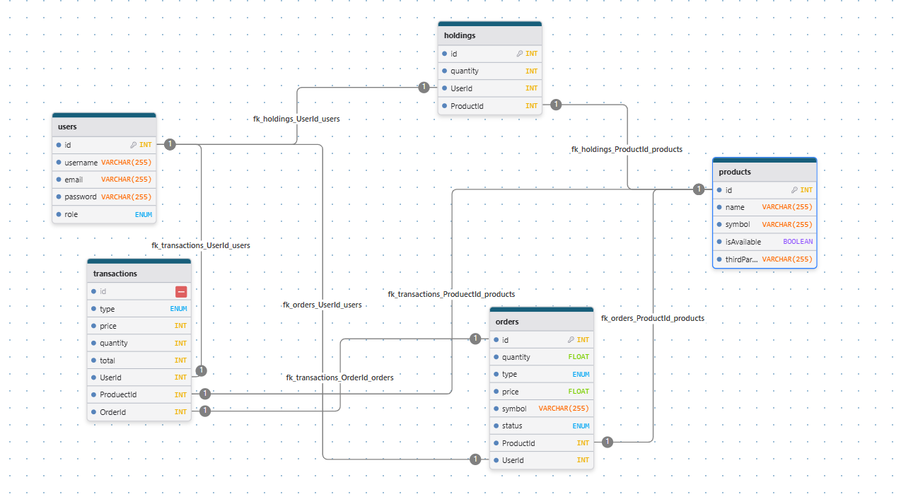

# 模擬交易平台 CoinHiro

CoinHiro 是為了瞭解市面上交易所 App 是如何運作，並著手實作專案，此專案可用來模擬虛擬貨幣買賣交易

---

## 目錄

- [專案介紹](#專案介紹)
- [安裝](#安裝)
- [環境變數設定](#環境變數設定)
- [使用說明](#使用說明)
- [目前更新功能](#目前更新功能)
- [尚未更新功能](#尚未更新功能)
- [技術架構](#技術架構)
- [測試](#測試)
- [資料庫圖示](#資料庫)
- [API 資源來源](#api-資源來源)

---

## 專案介紹

此專案為 trading system，使用 Node.js + Express 作後端框架 ， Passport JWT 做身份驗證，搭配 PostgreSQL 作為資料庫，使用 sequelize (ORM) 創建 並用 migrations 紀錄更新架構 ，使用第三方 coinGecko API 定時更新資料庫。

---

## 安裝

```bash
git clone https://github.com/你的帳號/專案名稱.git
cd 你的專案名稱
npm install
```

## 環境變數設定

建立 `.env` 檔案，內容示例：

```env
PORT = 你的port
HOST = "預設是localhost"
PRIVATE_KEY_PATH=./keys/private.key  //皆為預設值
PUBLIC_KEY_PATH=./keys/public.key    //皆為預設值
NODE_ENV=test or development //可查閱config內的database
```

## 使用說明

建議先安裝 `nodemon` 套件

```bash
nodemon sersver.js
```

## 目前更新功能

### 使用者系統

使用者註冊 / 登入

JWT 產生並儲存在 Cookie (HttpOnly)
→ 防止 XSS，避免前端 JavaScript 存取 Token

Passport-JWT 中介軟體 → API 認證驗證用戶身份

Joi 驗證格式 → 確保輸入資料完整正確

角色權限控管（User / Admin）

後台 Admin 權限專用接口

全域錯誤處理與資料驗證

### 交易與持倉管理

市價下單功能：

建立訂單

自動同步：

更新交易紀錄

更新持倉數量

更新持有平均成本

處理買入 / 賣出邏輯

持倉查詢：查看當前資產及平均成本

歷史交易紀錄查詢

### 第三方資料與即時價格

使用 第三方 API 即時抓取商品價格

Cron 排程任務 → 每月自動同步幣種資料庫

### 即時價格提醒通知

使用者可設置價格提醒條件（高於 / 低於）

每分鐘排程檢查，觸發後即時推送通知

採用 Redis 快取：

快取即時價格，避免頻繁呼叫外部 API

大幅提升即時性與效能

### 現價查詢

查看指定資產的最新價格

Redis 快取 → 減少對第三方 API 壓力

### 特色與優化

JWT + Cookie 安全機制設計完善

權限分級 → 使用者 / 管理者權限區隔

高效能 → Redis 快取機制

良好的架構 → 清楚的資料表關聯設計（持倉、訂單、交易紀錄）

## 尚未更新功能

- 錯誤優化
- 測試優化

## 技術架構

類別 技術 功能說明
後端 Node.js + Express RESTful API 建立
資料庫 PostgreSQL + Sequelize 關聯式資料庫 ORM 操作
認證 JWT + cookie-parser 使用者登入狀態管理
排程任務 node-cron 定時檢查即時價格與通知
即時 WebSocket (ws) 即時價格通知
快取 Redis 加速即時價格查詢
驗證 Joi API 請求參數驗證
測試 Jest + Supertest API 單元測試

## 測試

### 手動測試（Postman）

使用 /login 取得 token（HttpOnly Cookie）

帶著 cookie 呼叫其他需要驗證的 API

跨域測試 → 若從前端測試，請調整 cookie 設定如下：

```js
res.cookie("token", token, {
  httpOnly: true, // 防止 XSS
  maxAge: 24 * 60 * 60 * 1000, // 1 天
  secure: true, // 配合 sameSite: "none"，需使用 HTTPS
  sameSite: "none", // 跨域請求必設
});
```

### 自動化測試（Jest + Supertest）

```bash
npm run test
```

已整合 cross-env 自動將 NODE_ENV 設為 test

請確保測試資料庫獨立於正式資料庫

## 資料庫



## API 資源來源

本專案使用以下第三方 API：

- [CoinGecko API](https://docs.coingecko.com/reference/introduction) - 提供虛擬貨幣詳細資料

資料版權與使用條款請參考各官方文件。
