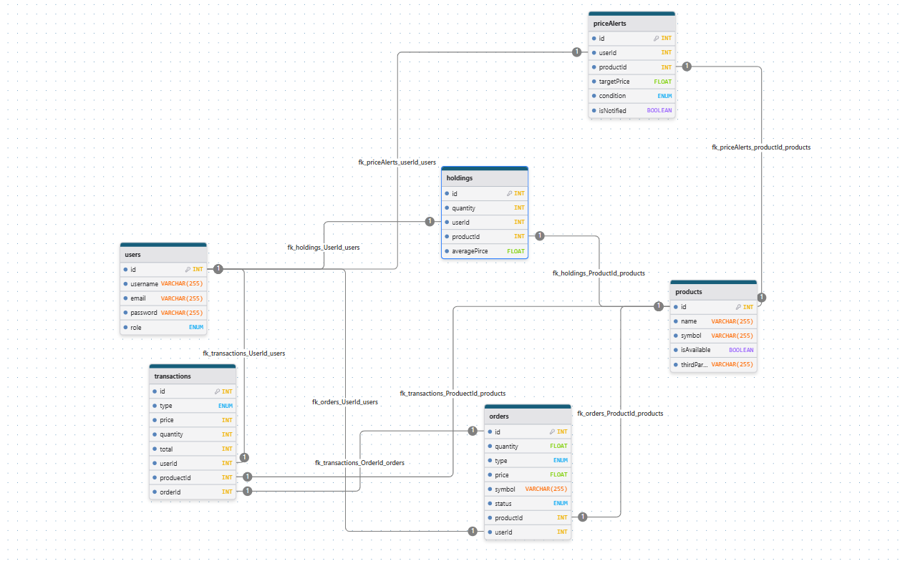

# 模擬交易平台 CoinHiro

CoinHiro 是為了瞭解市面上交易所 App 是如何運作，並著手實作專案，此專案可用來模擬虛擬貨幣買賣交易

---

## 目錄

- [專案介紹](#專案介紹)
- [安裝](#安裝)
- [環境變數設定](#環境變數設定)
- [使用說明](#使用說明)
- [目前更新功能](#目前更新功能)
- [尚未更新功能](#尚未更新功能)
- [授權與認證](#授權與認證)
- [測試](#測試)
- [資料庫圖示](#資料庫)
- [API 資源來源](#api-資源來源)

---

## 專案介紹

此專案為 trading system，使用 Node.js + Express 作後端框架 ， Passport JWT 做身份驗證，搭配 PostgreSQL 作為資料庫，使用 sequelize (ORM) 創建 並用 migrations 紀錄更新架構 ，使用第三方 coinGecko API 定時更新資料庫。

---

## 安裝

```bash
git clone https://github.com/你的帳號/專案名稱.git
cd 你的專案名稱
npm install
```

## 環境變數設定

建立 `.env` 檔案，內容示例：

```env
PORT = 你的port
HOST = "預設是localhost"
PRIVATE_KEY_PATH=./keys/private.key  //皆為預設值
PUBLIC_KEY_PATH=./keys/public.key    //皆為預設值
NODE_ENV=test or development //可查閱config內的database
```

## 使用說明

建議先安裝 `nodemon` 套件

```bash
nodemon sersver.js
```

## 目前更新功能

- 使用者註冊、登入
- JWT 產生與 Cookie 儲存 (HttpOnly) //為了防止 XSS 且使不易被 JS 讀取
- Passport JWT 中介軟體驗證
- Joi 驗證格式
- 角色權限控管 (User / Admin)
- 錯誤處理與基本驗證
- 後台 Admin 權限處理
- 使用者建立訂單(市價下單)模擬同時更新交易紀錄，持倉數量
- 賣出訂單
- 第三方 API 抓取資料 Cron 定期更新資料庫
- 查看持倉數量
- 歷史交易紀錄
- 模擬即時通知價格
- 查看現價

## 尚未更新功能

- 即時通知優化
- 前端架構

## 授權與認證

- 使用 Passport.js 搭配 passport-jwt 驗證 JWT Token。

- JWT Token 透過 HttpOnly Cookie 存取。

- 角色權限控管由 middleware authorizeRole 實作

## 測試

手動 Postman 測試 API，需先登入取得 cookie。
自動測試 jest / supertest 記得先將`.env`內的 NODE_ENV 更換在做測試每個 API request
也可以直接 `npm run test ` 已用 corss-env 將 test 輸入 避免出錯

若要跨域`cors`測試請更改設定並將:

```js
res.cookie("token", token, {
  httpOnly: true,
  maxAge: 24 * 60 * 60 * 1000, // 1 天
  secure: true, // 因為要同時設 sameSite=None，必須開啟 HTTPS
  sameSite: "none",
});
```

## 資料庫



## API 資源來源

本專案使用以下第三方 API：

- [CoinGecko API](https://docs.coingecko.com/reference/introduction) - 提供虛擬貨幣詳細資料

資料版權與使用條款請參考各官方文件。
